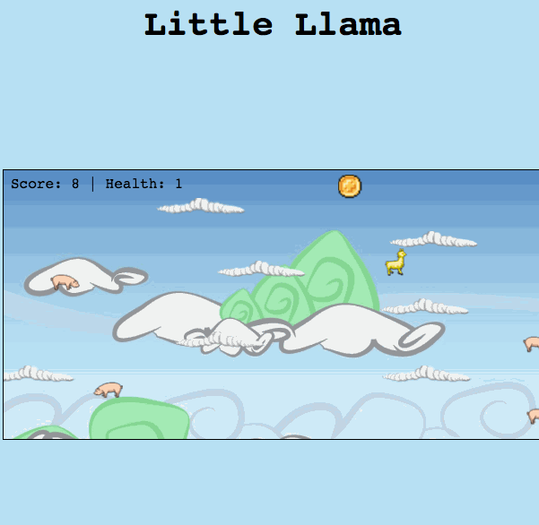

# Little Llama!!

[play here](https://micahbello.github.io/little_llama/)

### Background

*Little Llama* is a fun and fast paced platform game. The player controls a jumping llama who has to jump to and from moving clouds with the goal of reaching coins, all while avoiding the flying and bouncing pigs that are out to get him.


### How to play

The gameplay is simple. Use the up arrow to jump, left and right arrows to move horizontally. Jump from cloud to cloud and reach the spinning coin. Once the coin is obtained, a new coin will appear randomly on the screen and a new pig will fly in. The goal is to see how many coins can be obtained before the llama runs out of health. Colliding with a flying pig results in the deduction of a health point. The llama starts with 5 health points. Other objects will periodically appear on the screen and obtaining them will give varying results. Tacos will change the llama to green and give him better jumping abilities for 10 seconds. Stars turn the llama yellow and make him invincible for 10 seconds. A mud ball gets rid of one pig. Lastly, a heart will give the llama an additional health point.



### Technologies
* `JavaScript` for game logic
* `HTML5 Canvas` for animation rendering
* `CSS` for styling

Collisions abound! Various functions were written to detect collisions between the various objects within the game and give the desired result, depending on the state and location of the objects. Collision detection was at times tricky.

Below is the implementation for collision detection between the moving clouds (ledges) and bouncing pigs (balls):

```Javascript
ballLedgeCollision(ball, ledge) {
  let ledgeFront = ledge.x + ledge.width;
  let ledgeBottom = ledge.y + ledge.height;
  if (ball.x + ball.radius > ledge.x
      && ball.x - ball.radius < ledgeFront
      && ball.y + ball.radius > ledge.y
      && ball.y - ball.radius < ledgeBottom){
        if (ball.dy === Math.abs(ball.dy)) {
          ball.y = ledge.y - 9
        } else {
          ball.y = ledgeBottom + 9
        }
        ball.angle = 360 - ball.angle;
        ball.radians = ball.angle * Math.PI/ 180;
        ball.dx = Math.cos(ball.radians) * ball.speed;
        ball.dy = Math.sin(ball.radians) * ball.speed;
  }
```


### Future Features
* Implement database to store high scores
